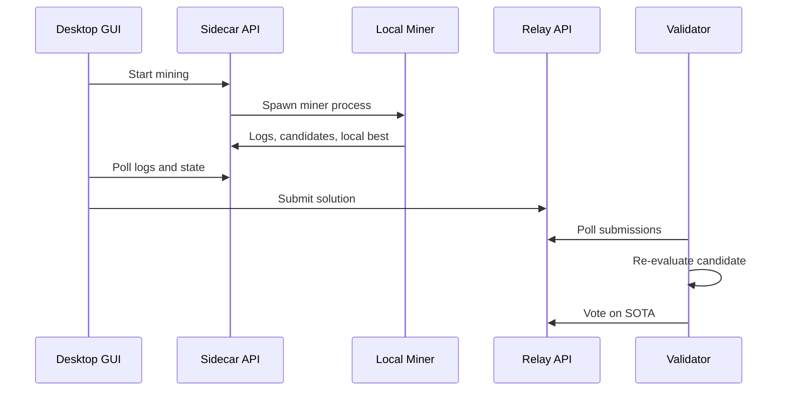
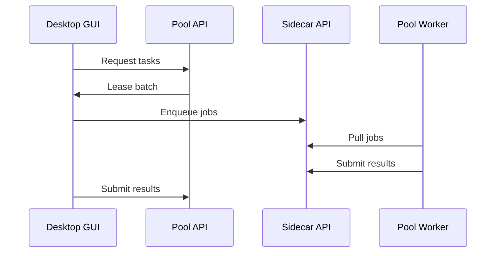
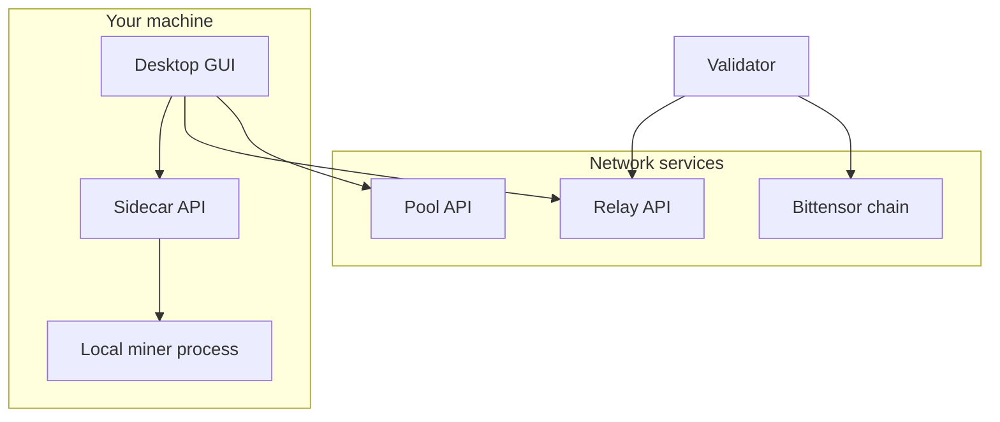

# Architecture

This page is a map of the runtime pieces and how they talk to each other.

## Direct mining flow

```mermaid
sequenceDiagram
  participant GUI as Desktop GUI
  participant Sidecar as Sidecar API
  participant Miner as Local Miner
  participant Relay as Relay API
  participant Val as Validator

  GUI->>Sidecar: Start mining
  Sidecar->>Miner: Spawn miner process
  Miner->>Sidecar: Logs, candidates, local best
  GUI->>Sidecar: Poll logs and state
  GUI->>Relay: Submit solution
  Val->>Relay: Poll submissions
  Val->>Val: Re-evaluate candidate
  Val->>Relay: Vote on SOTA
```

## Pool mining flow

```mermaid
sequenceDiagram
  participant GUI as Desktop GUI
  participant Pool as Pool API
  participant Sidecar as Sidecar API
  participant Worker as Pool Worker

  GUI->>Pool: Request tasks
  Pool->>GUI: Lease batch
  GUI->>Sidecar: Enqueue jobs
  Worker->>Sidecar: Pull jobs
  Worker->>Sidecar: Submit results
  GUI->>Pool: Submit results
```

## Service boundaries

```mermaid
flowchart TB
  subgraph Local[Your machine]
    GUI[Desktop GUI]
    Sidecar[Sidecar API]
    Miner[Local miner process]
    GUI --> Sidecar
    Sidecar --> Miner
  end

  subgraph Remote[Network services]
    Relay[Relay API]
    PoolAPI[Pool API]
    Chain[Bittensor chain]
  end

  GUI --> Relay
  GUI --> PoolAPI
  Validator[Validator] --> Relay
  Validator --> Chain
```

