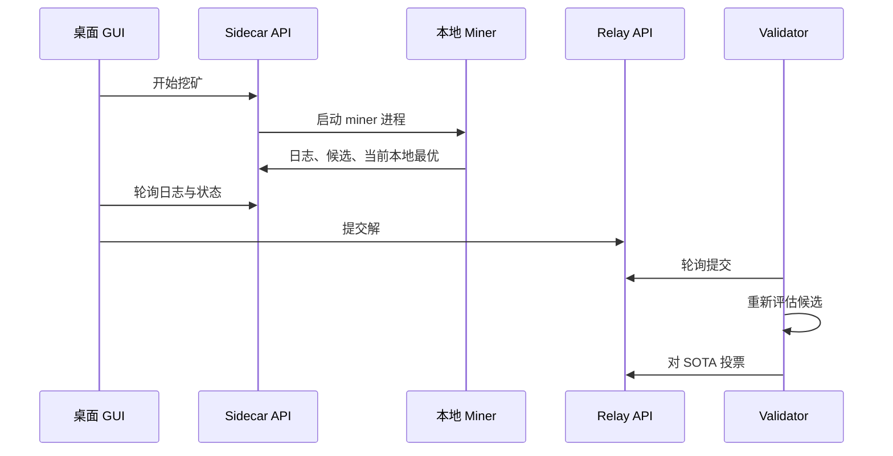
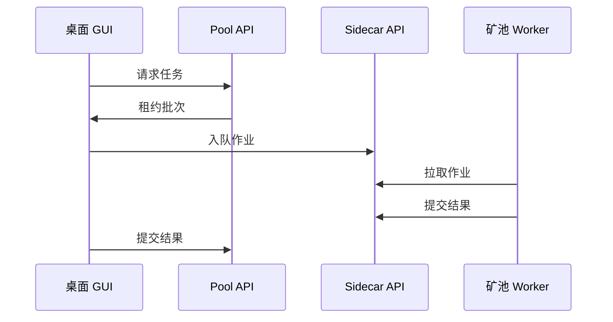
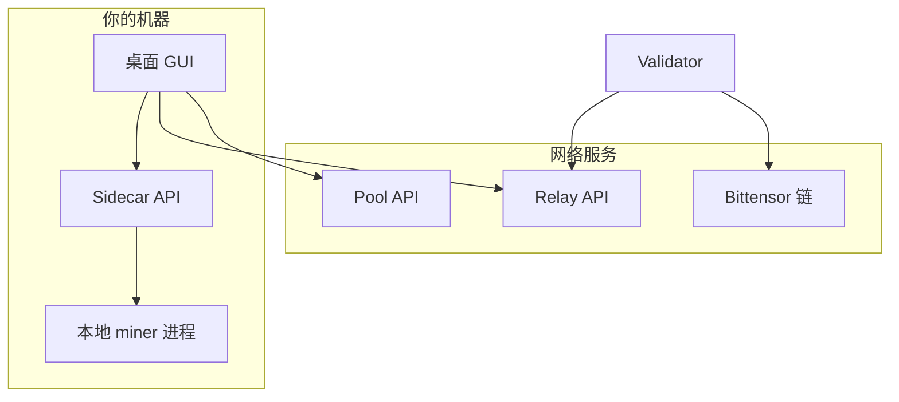

# 架构

本页用于梳理运行时组件，以及它们之间如何通信。

## 直接挖矿流程

```mermaid
sequenceDiagram
  participant GUI as 桌面 GUI
  participant Sidecar as Sidecar API
  participant Miner as 本地 Miner
  participant Relay as Relay API
  participant Val as Validator

  GUI->>Sidecar: 开始挖矿
  Sidecar->>Miner: 启动 miner 进程
  Miner->>Sidecar: 日志、候选、当前本地最优
  GUI->>Sidecar: 轮询日志与状态
  GUI->>Relay: 提交解
  Val->>Relay: 轮询提交
  Val->>Val: 重新评估候选
  Val->>Relay: 对 SOTA 投票
```

## 矿池挖矿流程

```mermaid
sequenceDiagram
  participant GUI as 桌面 GUI
  participant Pool as Pool API
  participant Sidecar as Sidecar API
  participant Worker as 矿池 Worker

  GUI->>Pool: 请求任务
  Pool->>GUI: 租约批次
  GUI->>Sidecar: 入队作业
  Worker->>Sidecar: 拉取作业
  Worker->>Sidecar: 提交结果
  GUI->>Pool: 提交结果
```

## 服务边界

```mermaid
flowchart TB
  subgraph Local[你的机器]
    GUI[桌面 GUI]
    Sidecar[Sidecar API]
    Miner[本地 miner 进程]
    GUI --> Sidecar
    Sidecar --> Miner
  end

  subgraph Remote[网络服务]
    Relay[Relay API]
    PoolAPI[Pool API]
    Chain[Bittensor 链]
  end

  GUI --> Relay
  GUI --> PoolAPI
  Validator[Validator] --> Relay
  Validator --> Chain
```
