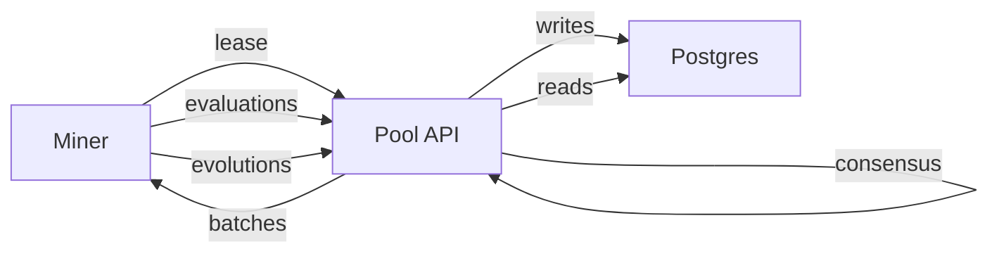

# Pool

The Pool is a separate service that coordinates collaborative mining:

- Miners register and authenticate with Bittensor signatures
- Miners request batches to evolve or evaluate algorithms
- The Pool aggregates evaluations and computes consensus
- Epoch logic turns miner contributions into payouts

## Local dev quickstart with docker compose

The fastest local loop is the sim compose stack:

```bash
docker compose -f Pool/docker-compose.sim.yaml up -d db api monitor
curl -sS http://127.0.0.1:8434/health
```

Open the monitor dashboard:

- `http://127.0.0.1:9000`

## Local dev quickstart without docker compose

If you prefer to run Postgres separately, see the full guide:

- [Pool Functional Testing](../guides/pool-functional-testing.md)

## How work flows



## Tasks, leases, and consensus

The Pool supports two request styles:

- `POST /api/v1/tasks/request` returns a batch id and algorithms
- `POST /api/v1/tasks/lease` returns a lease id plus:
  - algorithms to evaluate
  - seed algorithms to evolve
  - an evolve budget
  - a small gossip packet for miner coordination

Consensus is computed on the server side after enough evaluations exist for a candidate.

## Functional testing and simulators

See [Pool Functional Testing](../guides/pool-functional-testing.md).

## API reference

See [Pool API](../reference/pool-api.md).
