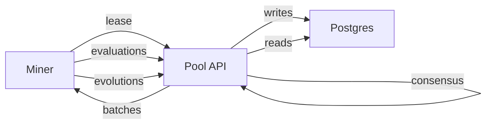

# Pool

Pool 是一个独立服务，用于协调协作挖矿：

- 矿工使用 Bittensor 签名进行注册与认证
- 矿工请求批次任务，用于演化或评估算法
- Pool 聚合评估结果并计算共识
- Epoch 逻辑把矿工贡献转换为支付

## 使用 docker compose 的本地开发快速启动

最快的本地闭环是 sim compose 栈：

```bash
docker compose -f Pool/docker-compose.sim.yaml up -d db api monitor
curl -sS http://127.0.0.1:8434/health
```

打开监控面板：

- `http://127.0.0.1:9000`

## 不使用 docker compose 的本地开发快速启动

如果你更倾向于单独启动 Postgres，请参考完整指南：

- [矿池功能测试](../guides/pool-functional-testing.md)

## 工作流概览



## 任务、租约与共识

Pool 支持两种请求方式：

- `POST /api/v1/tasks/request` 返回 batch id 与 algorithms
- `POST /api/v1/tasks/lease` 返回 lease id，并包含：
  - 待评估的 algorithms
  - 待演化的 seed algorithms
  - 演化预算
  - 用于矿工协作的小 gossip 包

当某个候选拥有足够的评估样本后，服务器端会计算共识。

## 功能测试与模拟器

参考 [矿池功能测试](../guides/pool-functional-testing.md)。

## API 参考

参考 [Pool API](../reference/pool-api.md)。
