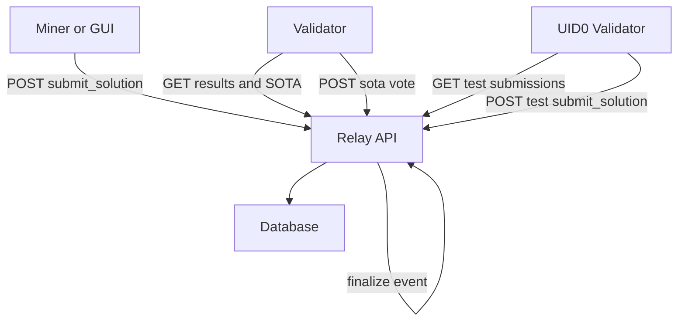
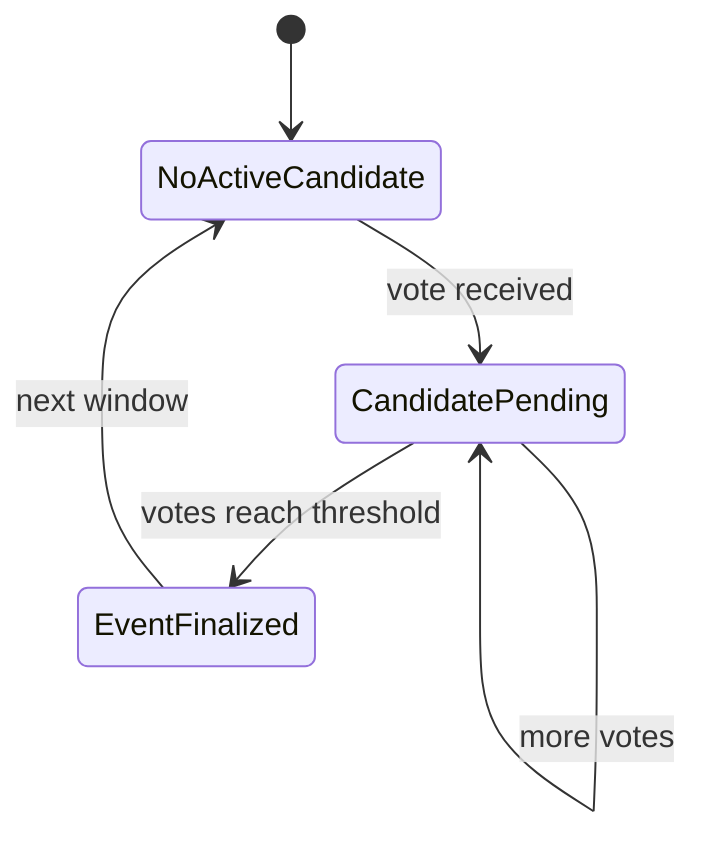

# Relay

The relay is a FastAPI service that sits between miners and validators. It:

- Accepts miner submissions
- Accepts UID0-only test submissions for logging
- Lets validators fetch submissions and the current SOTA threshold
- Aggregates validator votes to finalize SOTA events
- Exposes a simple API for the GUI and validator nodes

## When to use it

- Direct mining: the GUI submits solutions to the relay and validators poll it
- Pool mode: the Pool can optionally submit its best results to the relay
- Local testing: run the relay in `--test` mode for an end-to-end loop

## Run locally in test mode

Test mode enables a smooth local loop:
- no metagraph whitelist gating for validators
- uses a writable local SQLite file by default
- uses `ADMIN_AUTH_TOKEN=dev` unless overridden

```bash
python3 -m pip install -r requirements.txt -r relay/requirements.txt
SOTA_CONSENSUS_VOTES=1 SOTA_ALIGNMENT_MOD=1 python3 -m relay --test --host 127.0.0.1 --port 8002
```

If you hit a read-only SQLite error, pin the DB path:

```bash
python3 -m relay --test --database-url "sqlite:///./bitsota_relay_test.db" --host 127.0.0.1 --port 8002
```

## Run in production

At minimum, you must provide:

- `DATABASE_URL` (Postgres or SQLite)
- `ADMIN_AUTH_TOKEN` (used by admin-only endpoints)

Then run:

```bash
python3 -m pip install -r requirements.txt -r relay/requirements.txt
python3 -m relay --host 0.0.0.0 --port 8002
```

## Health checks

```bash
curl http://127.0.0.1:8002/health
curl http://127.0.0.1:8002/sota_threshold
curl "http://127.0.0.1:8002/sota-events?page=1&page_size=10"
```

## Admin dashboard

- HTML: `http://127.0.0.1:8002/admin/dashboard` (HTTP Basic; defaults to `admin` + `ADMIN_AUTH_TOKEN`)
- JSON: `GET /admin/status` (use `X-Auth-Token`)

## Auth model

The relay uses request headers for authenticated endpoints:

- Miner endpoints: `X-Key`, `X-Timestamp`, `X-Signature`
- Validator endpoints: `X-Key`, `X-Timestamp`, `X-Signature` and validator allowlist checks
- Admin endpoints: `X-Auth-Token`

In `--test` mode, validator allowlist checks are disabled.

## Request flow



## SOTA vote lifecycle



## Key configuration

The relay reads these environment variables:

- `DATABASE_URL` and `ADMIN_AUTH_TOKEN` are required in non-test mode
- `BITSOTA_TEST_MODE=1` enables test mode (also set by `python3 -m relay --test`)
- `BITSOTA_TEST_INVITE_CODE` sets the invite code accepted in test mode
- `RELAY_UID0_HOTKEY` optionally pins the UID0 hotkey used for test submissions
- `SOTA_CONSENSUS_VOTES` sets how many validator votes are needed to finalize
- `SOTA_ALIGNMENT_MOD`, `SOTA_T2_BLOCKS`, `SOTA_T2_INTERVALS` tune the SOTA window schedule
- `DEFAULT_SOTA_THRESHOLD` sets the initial SOTA threshold before any events exist
- Admin dashboard:
  - `ADMIN_DASHBOARD_USERNAME` and `ADMIN_DASHBOARD_PASSWORD` (defaults to `admin` + `ADMIN_AUTH_TOKEN`)
  - `ADMIN_DASHBOARD_REFRESH_SECONDS`
- Logging:
  - `RELAY_LOG_LEVEL` or `LOG_LEVEL`
  - `RELAY_LOG_FILE` (default `logs/relay.log`)

## API reference

See [Relay API](../reference/relay-api.md).
