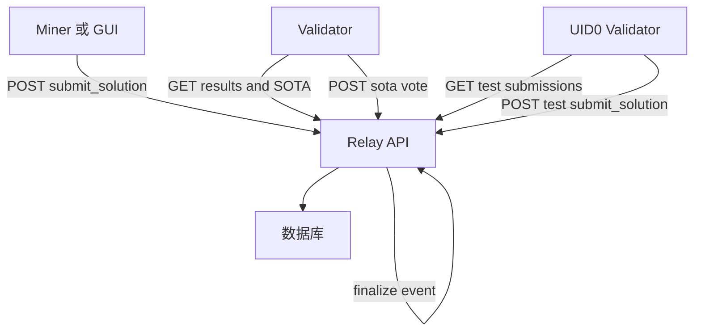
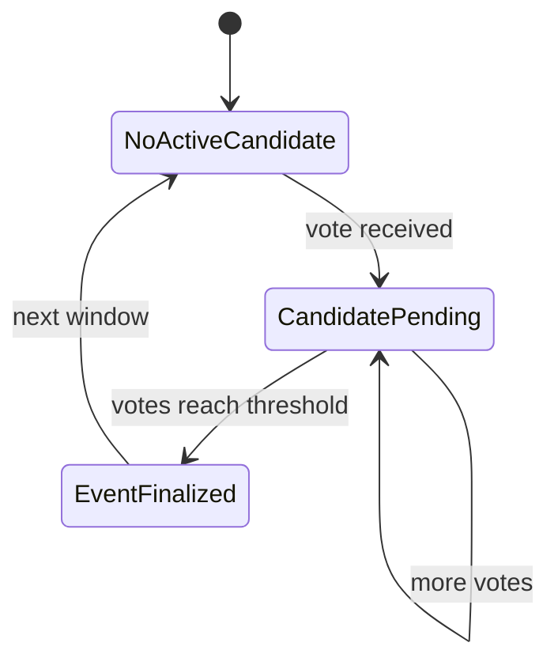

# Relay

Relay 是一个 FastAPI 服务，位于矿工与验证者之间。它会：

- 接收矿工提交
- 接收仅 UID0 的测试提交，用于日志与调试
- 允许验证者拉取提交与当前 SOTA 阈值
- 汇总验证者投票并最终确定 SOTA 事件
- 为 GUI 与验证者节点暴露一套简单 API

## 何时使用

- 直接挖矿：GUI 将解提交到 relay，验证者轮询 relay
- 矿池模式：Pool 可以选择把最佳结果提交到 relay
- 本地测试：以 `--test` 模式运行 relay，串起端到端本地流程

## 本地以测试模式运行

测试模式让本地闭环更顺畅：
- 验证者不再受 metagraph 白名单限制
- 默认使用可写的本地 SQLite 文件
- 默认使用 `ADMIN_AUTH_TOKEN=dev`，除非你显式覆盖

```bash
python3 -m pip install -r requirements.txt -r relay/requirements.txt
SOTA_CONSENSUS_VOTES=1 SOTA_ALIGNMENT_MOD=1 python3 -m relay --test --host 127.0.0.1 --port 8002
```

如果遇到只读 SQLite 错误，请显式指定 DB 路径：

```bash
python3 -m relay --test --database-url "sqlite:///./bitsota_relay_test.db" --host 127.0.0.1 --port 8002
```

## 生产环境运行

至少需要提供：

- `DATABASE_URL`  假设使用 Postgres 或 SQLite
- `ADMIN_AUTH_TOKEN`  管理员专用接口使用

然后运行：

```bash
python3 -m pip install -r requirements.txt -r relay/requirements.txt
python3 -m relay --host 0.0.0.0 --port 8002
```

## 健康检查

```bash
curl http://127.0.0.1:8002/health
curl http://127.0.0.1:8002/sota_threshold
curl "http://127.0.0.1:8002/sota-events?page=1&page_size=10"
```

## 管理后台

- HTML：`http://127.0.0.1:8002/admin/dashboard`（HTTP Basic；默认 `admin` 加 `ADMIN_AUTH_TOKEN`）
- JSON：`GET /admin/status`（使用 `X-Auth-Token`）

## 认证模型

relay 通过请求头对需要鉴权的接口进行认证：

- Miner 接口：`X-Key`, `X-Timestamp`, `X-Signature`
- Validator 接口：`X-Key`, `X-Timestamp`, `X-Signature`，并进行验证者 allowlist 校验
- Admin 接口：`X-Auth-Token`

在 `--test` 模式下，会禁用验证者 allowlist 校验。

## 请求流



## SOTA 投票生命周期



## 关键配置

relay 会读取以下环境变量：

- `DATABASE_URL` 与 `ADMIN_AUTH_TOKEN`：非测试模式必需
- `BITSOTA_TEST_MODE=1`：启用测试模式 也会由 `python3 -m relay --test` 自动设置
- `BITSOTA_TEST_INVITE_CODE`：设置测试模式接受的邀请码
- `RELAY_UID0_HOTKEY`：可选，固定 UID0 热键，用于测试提交
- `SOTA_CONSENSUS_VOTES`：最终确定事件需要的验证者投票数
- `SOTA_ALIGNMENT_MOD`, `SOTA_T2_BLOCKS`, `SOTA_T2_INTERVALS`：SOTA 窗口调度参数
- `DEFAULT_SOTA_THRESHOLD`：在没有任何事件之前的初始阈值
- 管理后台：
  - `ADMIN_DASHBOARD_USERNAME` 与 `ADMIN_DASHBOARD_PASSWORD` 默认 `admin` 加 `ADMIN_AUTH_TOKEN`
  - `ADMIN_DASHBOARD_REFRESH_SECONDS`
- 日志：
  - `RELAY_LOG_LEVEL` 或 `LOG_LEVEL`
  - `RELAY_LOG_FILE` 默认 `logs/relay.log`

## API 参考

参考 [Relay API](../reference/relay-api.md)。
