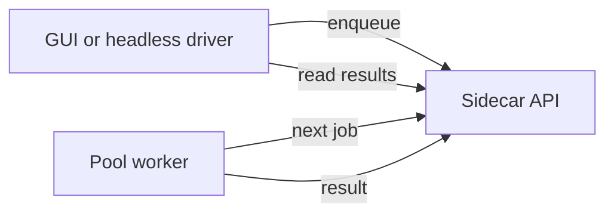

# Sidecar

The sidecar is a local FastAPI service that the GUI talks to. It:

- Starts a local miner process
- Streams logs and state to the GUI
- Hosts a local job queue used by Pool mode

## Run locally

```bash
python3 -m sidecar --host 127.0.0.1 --port 8123
curl http://127.0.0.1:8123/health
```

## Endpoints you will use in practice

- `GET /health` and `GET /state` for basic sanity checks
- `GET /logs` and `GET /candidates` for GUI log and candidate polling
- `POST /jobs/enqueue`, `GET /jobs/next`, `POST /jobs/{job_id}/result` for Pool mode

## Job queue flow


