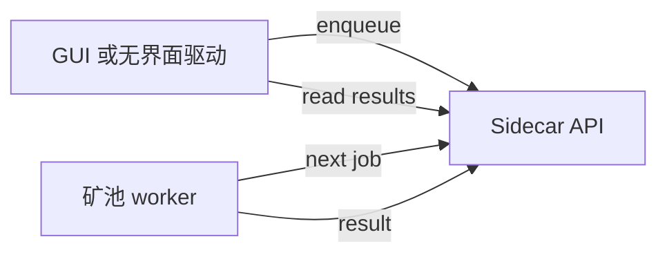

# Sidecar

Sidecar 是一个本地 FastAPI 服务，GUI 会与它通信。它会：

- 启动本地 miner 进程
- 向 GUI 流式输出日志与状态
- 承载矿池模式使用的本地作业队列

## 本地运行

```bash
python3 -m sidecar --host 127.0.0.1 --port 8123
curl http://127.0.0.1:8123/health
```

## 实际会用到的接口

- `GET /health` 与 `GET /state`：基础健康检查
- `GET /logs` 与 `GET /candidates`：GUI 轮询日志与候选
- `POST /jobs/enqueue`, `GET /jobs/next`, `POST /jobs/{job_id}/result`：矿池模式作业队列

## 作业队列流程


