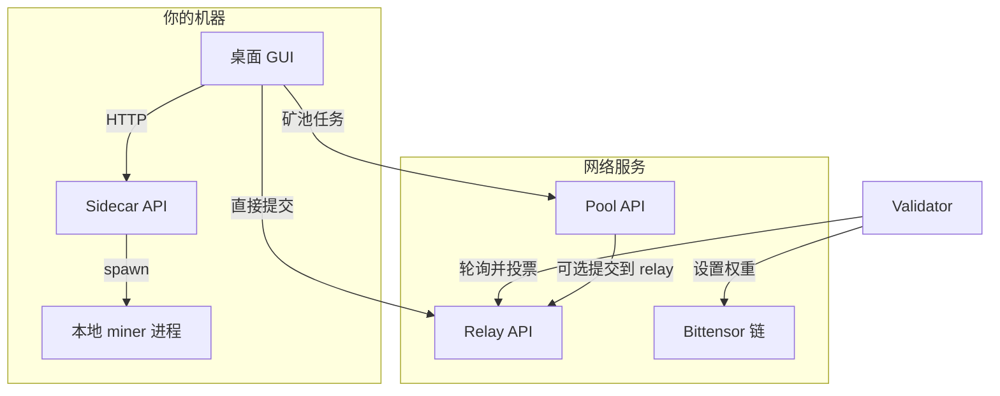

# BitSota 文档

BitSota 是 Bittensor 上的去中心化研究子网。本套文档按以下维度组织：

- 角色：矿工、验证者、矿池运营者
- 组件：GUI、Sidecar、Relay、Pool
- 工作流：直接挖矿、矿池挖矿、本地端到端测试

## 从这里开始

- [快速开始](getting-started.md)
- [本地测试](local-testing.md)
- [配置参考](configuration.md)

## 系统概览

文档与脚本默认使用的本地端口：
- Relay: `8002`
- Sidecar: `8123`
- Pool API: `8434`
- Pool 监控面板: `9000`
