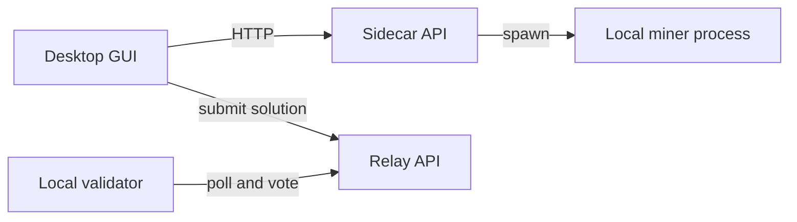

# Local Testing (GUI + Local Sidecar + Local Relay + Local Validator)

This guide runs a full local loop on one machine:

`GUI → Local Sidecar (FastAPI) → Local Miner → Local Sidecar → GUI → Local Relay (FastAPI) → Local Validator (polls relay + votes)`

Key behavior:
- The GUI does **not** run mining in-process anymore.
- Clicking “Start Mining” in the GUI spawns:
  - a local HTTP sidecar (`python3 -m sidecar`)
  - a local miner process (`python3 -m scripts.miner_local_og_sidecar`) that reports to the sidecar
- The GUI polls the sidecar for logs/candidates/local SOTA and remains the only component that submits solutions to the relay.

## System diagram



## 0) Install (dev environment)

From the repo root:

```bash
python3 -m venv .venv
source .venv/bin/activate
python3 -m pip install -U pip
python3 -m pip install -r requirements.txt -r relay/requirements.txt
python3 -m pip install -e .
```

## 1a) Sidecar defaults (local only)

The GUI uses a fixed localhost port for the sidecar:
- `BITSOTA_SIDECAR_HOST` (default `127.0.0.1`)
- `BITSOTA_SIDECAR_PORT` (default `8123`)

If the port is already in use, set a different port before launching the GUI:

```bash
export BITSOTA_SIDECAR_PORT=8124
```

## 1) Start a local relay (test mode)

Relay test mode:
- uses a per-user SQLite file in your OS temp dir (override with `--database-url`)
- accepts any validator hotkey (no metagraph whitelist)
- skips miner invite-code gating

Run:

```bash
SOTA_CONSENSUS_VOTES=1 SOTA_ALIGNMENT_MOD=1 python3 -m relay --test --host 127.0.0.1 --port 8002
```

If you hit `sqlite3.OperationalError: attempt to write a readonly database`, force the DB path to somewhere you own:

```bash
SOTA_CONSENSUS_VOTES=1 SOTA_ALIGNMENT_MOD=1 python3 -m relay --test \
  --database-url "sqlite:///./bitsota_relay_test.db" \
  --host 127.0.0.1 --port 8002
```

Quick checks:

```bash
curl http://127.0.0.1:8002/health
curl http://127.0.0.1:8002/sota_threshold
curl "http://127.0.0.1:8002/sota-events?page=1&page_size=10"
```

Admin dashboard:

- `http://127.0.0.1:8002/admin/dashboard`
- In `--test` mode the default credentials are `admin` / `dev`
- JSON status: `curl -H "X-Auth-Token: dev" http://127.0.0.1:8002/admin/status`

To reset relay state, delete the SQLite file you’re using (recommended: run with `--database-url "sqlite:///./bitsota_relay_test.db"` so it’s easy to remove):

```bash
rm -f ./bitsota_relay_test.db
```

## 2) Point the GUI miner at the local relay

Create `gui_config.json` in the repo root:

```json
{
  "relay_endpoint": "http://127.0.0.1:8002",
  "update_manifest_url": "http://127.0.0.1:8002/version.json",
  "test_mode": true,
  "test_invite_code": "TESTTEST1",
  "miner_validate_every_n_generations": 1000,
  "problem_config_path": "./problem_config.json"
}
```

Create a starting problem config:

```bash
cp problem_config.json.example problem_config.json
```

Then start the GUI:

```bash
python3 -m gui
```

Notes:
- If you don’t set `test_mode: true`, the GUI will prompt for an invite code; in relay test mode, `TESTTEST1` works.
- The GUI reads overrides from `BITSOTA_GUI_CONFIG` or these paths (first match): `./bitsota_gui_config.json`, `./gui_config.json`, `~/.bitsota/gui_config.json`.
- For mining hyperparameters beyond the few GUI config keys, point `problem_config_path` at a JSON file (start from `problem_config.json.example`). If `problem_config_path` is omitted, the GUI will also auto-load `./problem_config.json` or `~/.bitsota/problem_config.json` (or `BITSOTA_PROBLEM_CONFIG`).
- The same `problem_config.json` can also be used to drive the sidecar-reporting miner via `python3 -m scripts.miner_local_og_sidecar --config problem_config.json ...` (see Section 2a).
- The GUI mines until stopped; it does not use `args.iterations`.
- The “Task Type” dropdown includes CIFAR-10 Binary, MNIST Binary, and Scalar Linear.

## 2a) Optional: run sidecar + miner without the GUI (debug)

Start the sidecar:

```bash
python3 -m sidecar --host 127.0.0.1 --port ${BITSOTA_SIDECAR_PORT:-8123}
```

Quick checks:

```bash
curl http://127.0.0.1:${BITSOTA_SIDECAR_PORT:-8123}/health
curl http://127.0.0.1:${BITSOTA_SIDECAR_PORT:-8123}/state
```

Run the miner that reports progress/candidates to the sidecar:

```bash
python3 -m scripts.miner_local_og_sidecar \
  --sidecar-url http://127.0.0.1:${BITSOTA_SIDECAR_PORT:-8123} \
  --run-id local_debug \
  --config ./problem_config.json \
  --task-type scalar_linear \
  --engine baseline \
  --workers 2 \
  --validate-every 0
```

Poll logs/candidates:

```bash
curl "http://127.0.0.1:${BITSOTA_SIDECAR_PORT:-8123}/logs?cursor=0&limit=20"
curl "http://127.0.0.1:${BITSOTA_SIDECAR_PORT:-8123}/candidates?cursor=0&limit=20"
```

## 2b) Pool mode via sidecar job queue (no new GUI needed)

Important: there is still only **one** sidecar process (`python3 -m sidecar`).

Pool mode reuses the same sidecar, but with an added local job queue:
- GUI (or a headless driver) talks to the Pool API and enqueues work into sidecar.
- A compute-only worker process (`scripts.pool_miner_sidecar`) pulls jobs from sidecar and returns results.

### Start the Pool API (local)

This starts Postgres + the Pool API on `http://127.0.0.1:8434`:

```bash
docker compose -f Pool/docker-compose.sim.yaml up -d db api
curl -sS http://127.0.0.1:8434/health
```

### Start the sidecar + pool compute worker

```bash
PYENV_VERSION=automl python3 -m sidecar --host 127.0.0.1 --port ${BITSOTA_SIDECAR_PORT:-8123}
```

In a second terminal:

```bash
PYENV_VERSION=automl python3 -m scripts.pool_miner_sidecar \
  --sidecar-url http://127.0.0.1:${BITSOTA_SIDECAR_PORT:-8123} \
  --run-id pool_smoke \
  --workers 1
```

### Drive tasks without the GUI (smoke test)

This headless driver signs Pool requests with a generated SR25519 hotkey, requests Pool tasks, and submits results after the worker finishes.

```bash
PYENV_VERSION=automl python3 -m scripts.pool_sidecar_driver \
  --pool-url http://127.0.0.1:8434 \
  --sidecar-url http://127.0.0.1:${BITSOTA_SIDECAR_PORT:-8123} \
  --run-id pool_smoke \
  --duration-s 20
```

You should see log lines like:
- `[pool] Enqueued job kind=evolve ...`
- `[pool] submit_evolution ok=True ...`
- `[pool] submit_evaluation ok=True ...`

### Monitor the pool (retro terminal)

In another terminal:

```bash
python3 -m scripts.pool_monitor --pool-url http://127.0.0.1:8434 --task-type cifar10_binary
```

### Use the GUI (optional)

Point the GUI at the local pool by setting `pool_endpoint` in `gui_config.json`:

```json
{
  "pool_endpoint": "http://127.0.0.1:8434"
}
```

Then start the GUI and select `Pool` in the Task dropdown. The GUI stays a thin wrapper:
- It talks to the Pool API and enqueues sidecar jobs.
- The pool worker does the compute via sidecar.

## 3) Start a local validator (poll + verify + vote)

Create a hotkey if you don’t already have one:

```bash
btcli wallet new_coldkey --wallet.name local_val
btcli wallet new_hotkey --wallet.name local_val --wallet.hotkey local_val_hot
```

Run the local relay validator:

```bash
python3 -m validator.local_validator \
  --relay-url http://127.0.0.1:8002 \
  --wallet-name local_val \
  --wallet-hotkey local_val_hot \
  --poll-interval 5
```

Tips:
- Tune the suite in `validator_hyperparams.json` (`task_count` / `task_seed`).
  - One-off override still works: `VALIDATOR_TASK_COUNT=8 python3 -m validator.local_validator ...`
- If you want to test relay “consensus” with `SOTA_CONSENSUS_VOTES>1`, run two validator processes with different hotkeys (or set `--seen-block-mode fixed --seen-block 1` on both so they always vote in the same round).
- Reduce log noise: add `--relay-client-log-level WARNING` (it controls the `validator.relay_client` HTTP poll logs).
- Counters: `validator.local_validator` prints a periodic stats summary (default every 30s; change with `--stats-interval`, disable with `--stats-interval 0`) and writes JSONL metrics to `local_validator_metrics.log` (disable with `--metrics-log ""`).

## 4) Run an end-to-end check

1. Start relay (Section 1)
2. Start local validator (Section 3)
3. Start GUI miner (Section 2) and click “Start Mining”

You should see:
- GUI logs populated from the local sidecar
- GUI “Local SOTA” updating from sidecar state as submissions succeed
- GUI submissions accepted by the relay (`/submit_solution`)
- Validator logs showing re-evaluation + `/sota/vote`
	- Relay `/sota_threshold` increasing after accepted votes (when `SOTA_CONSENSUS_VOTES=1`)

## 5) Profile “1 generation” call paths (miner_local_og vs GUI-like vs actual GUI)

These commands generate `cProfile` `.pstats` files so you can compare total function-call counts and hotspots for a *single* `evolve_generation()` step.

Notes:
- The *first* generation can include “population initialization” cost (baseline engines fill the queue/population on first use). Use warmup to measure steady-state per-generation cost.
- Use the same `problem_config.json`/`gui_config.json` you mine with so the engine params match.

### A) `miner_local_og` (one generation, steady-state)

```bash
python3 -m scripts.profile_miner_local_one_iter \
  --task-type scalar_linear \
  --engine baseline \
  --seed 123 \
  --pop-size 100 \
  --miner-task-count 10 \
  --tournament-size 10 \
  --mutation-prob 0.9 \
  --fec-cache-size 0 \
  --warmup-generations 1 \
  --out /tmp/miner_local_one_iter.pstats
```

### B) GUI-like (`DirectClient._mine_until_sota`) without Qt

```bash
python3 -m scripts.profile_gui_like \
  --config ./problem_config.json \
  --task-type scalar_linear \
  --engine baseline \
  --seed 123 \
  --generations 1 \
  --checkpoint-generations 1000000 \
  --offline-sota-threshold 1e9 \
  --no-simulate-gui-log-handler \
  --log-level WARNING \
  --out /tmp/gui_like_one_gen_no_gui_log.pstats
```

To include an approximation of the GUI log parsing/sink overhead (still no Qt):

```bash
python3 -m scripts.profile_gui_like \
  --config ./problem_config.json \
  --task-type scalar_linear \
  --engine baseline \
  --seed 123 \
  --generations 1 \
  --checkpoint-generations 10 \
  --offline-sota-threshold 1e9 \
  --simulate-gui-log-handler \
  --sink-lines 5000 \
  --out /tmp/gui_like_one_gen_sim_gui_log.pstats
```

### C) Sidecar miner run (closest to current GUI mining backend)

Profile the sidecar-reporting miner directly:

```bash
python3 -m cProfile -o /tmp/sidecar_miner_one_run.pstats -m scripts.miner_local_og_sidecar \
  --sidecar-url http://127.0.0.1:${BITSOTA_SIDECAR_PORT:-8123} \
  --run-id profile_run \
  --task-type scalar_linear \
  --engine baseline \
  --workers 1 \
  --iterations 50 \
  --validate-every 0
```

### D) Summarize call counts

```bash
python3 -m scripts.pstats_calls_summary /tmp/miner_local_one_iter.pstats
python3 -m scripts.pstats_calls_summary /tmp/gui_like_one_gen_no_gui_log.pstats
python3 -m scripts.pstats_calls_summary /tmp/sidecar_miner_one_run.pstats
```
