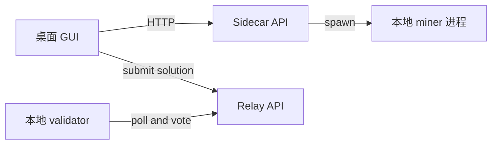

# 本地测试：GUI + 本地 Sidecar + 本地 Relay + 本地 Validator

本指南在一台机器上跑通完整的本地闭环：

`GUI → 本地 Sidecar FastAPI → 本地 Miner → 本地 Sidecar → GUI → 本地 Relay FastAPI → 本地 Validator 轮询并投票`

关键行为：
- GUI 不再在进程内直接执行挖矿逻辑
- 在 GUI 中点击 “Start Mining” 会启动：
  - 一个本地 HTTP sidecar：`python3 -m sidecar`
  - 一个本地 miner 进程：`python3 -m scripts.miner_local_og_sidecar`，它向 sidecar 汇报
- GUI 会轮询 sidecar 获取 logs、candidates、local SOTA，并且仍然由 GUI 负责向 relay 提交解

## 系统图



## 0  安装  开发环境

在仓库根目录执行：

```bash
python3 -m venv .venv
source .venv/bin/activate
python3 -m pip install -U pip
python3 -m pip install -r requirements.txt -r relay/requirements.txt
python3 -m pip install -e .
```

## 1a  Sidecar 默认值  仅本地

GUI 会使用固定的 localhost 端口与 sidecar 通信：
- `BITSOTA_SIDECAR_HOST` 默认 `127.0.0.1`
- `BITSOTA_SIDECAR_PORT` 默认 `8123`

如果端口已被占用，请在启动 GUI 前设置一个新端口：

```bash
export BITSOTA_SIDECAR_PORT=8124
```

## 1  启动本地 relay  测试模式

relay 的测试模式：
- 默认在系统临时目录中使用每用户一个 SQLite 文件，可以用 `--database-url` 覆盖
- 接受任意验证者热键，不使用 metagraph 白名单
- 跳过矿工邀请码校验

运行：

```bash
SOTA_CONSENSUS_VOTES=1 SOTA_ALIGNMENT_MOD=1 python3 -m relay --test --host 127.0.0.1 --port 8002
```

如果遇到 `sqlite3.OperationalError: attempt to write a readonly database`，请把 DB 路径固定到你有权限的位置：

```bash
SOTA_CONSENSUS_VOTES=1 SOTA_ALIGNMENT_MOD=1 python3 -m relay --test \
  --database-url "sqlite:///./bitsota_relay_test.db" \
  --host 127.0.0.1 --port 8002
```

快速检查：

```bash
curl http://127.0.0.1:8002/health
curl http://127.0.0.1:8002/sota_threshold
curl "http://127.0.0.1:8002/sota-events?page=1&page_size=10"
```

管理后台：

- `http://127.0.0.1:8002/admin/dashboard`
- 在 `--test` 模式下默认账号密码为 `admin` / `dev`
- JSON 状态：`curl -H "X-Auth-Token: dev" http://127.0.0.1:8002/admin/status`

要重置 relay 状态，请删除你在使用的 SQLite 文件。建议用 `--database-url "sqlite:///./bitsota_relay_test.db"`，这样更容易清理：

```bash
rm -f ./bitsota_relay_test.db
```

## 2  让 GUI miner 指向本地 relay

在仓库根目录创建 `gui_config.json`：

```json
{
  "relay_endpoint": "http://127.0.0.1:8002",
  "update_manifest_url": "http://127.0.0.1:8002/version.json",
  "test_mode": true,
  "test_invite_code": "TESTTEST1",
  "miner_validate_every_n_generations": 1000,
  "problem_config_path": "./problem_config.json"
}
```

创建一个初始 problem config：

```bash
cp problem_config.json.example problem_config.json
```

然后启动 GUI：

```bash
python3 -m gui
```

说明：
- 如果不设置 `test_mode: true`，GUI 会提示输入邀请码。在 relay 测试模式下，`TESTTEST1` 可用。
- GUI 会从 `BITSOTA_GUI_CONFIG` 或以下路径读取覆盖配置，命中即止：`./bitsota_gui_config.json`、`./gui_config.json`、`~/.bitsota/gui_config.json`。
- 如果要调整挖矿超参数，除了少量 GUI 配置键外，请把 `problem_config_path` 指向一个 JSON 文件，建议从 `problem_config.json.example` 开始。如果省略 `problem_config_path`，GUI 也会自动加载 `./problem_config.json` 或 `~/.bitsota/problem_config.json`，或使用 `BITSOTA_PROBLEM_CONFIG`。
- 同一个 `problem_config.json` 也可用于 sidecar 上报矿工：`python3 -m scripts.miner_local_og_sidecar --config problem_config.json ...`，参考 2a。
- GUI 会一直挖到你停止为止，它不会使用 `args.iterations`。
- “Task Type” 下拉框包含 CIFAR-10 Binary、MNIST Binary 与 Scalar Linear。

## 2a  可选：不使用 GUI 运行 sidecar 与 miner  调试

启动 sidecar：

```bash
python3 -m sidecar --host 127.0.0.1 --port ${BITSOTA_SIDECAR_PORT:-8123}
```

快速检查：

```bash
curl http://127.0.0.1:${BITSOTA_SIDECAR_PORT:-8123}/health
curl http://127.0.0.1:${BITSOTA_SIDECAR_PORT:-8123}/state
```

运行向 sidecar 汇报进度与候选的 miner：

```bash
python3 -m scripts.miner_local_og_sidecar \
  --sidecar-url http://127.0.0.1:${BITSOTA_SIDECAR_PORT:-8123} \
  --run-id local_debug \
  --config ./problem_config.json \
  --task-type scalar_linear \
  --engine baseline \
  --workers 2 \
  --validate-every 0
```

轮询 logs 与 candidates：

```bash
curl "http://127.0.0.1:${BITSOTA_SIDECAR_PORT:-8123}/logs?cursor=0&limit=20"
curl "http://127.0.0.1:${BITSOTA_SIDECAR_PORT:-8123}/candidates?cursor=0&limit=20"
```

## 2b  通过 sidecar 作业队列启用矿池模式  不需要新 GUI

重要：依然只有 **一个** sidecar 进程：`python3 -m sidecar`。

矿池模式复用同一个 sidecar，并在其上增加本地作业队列：
- GUI 或无界面驱动与 Pool API 通信，并把工作入队到 sidecar
- 纯计算 worker 进程 `scripts.pool_miner_sidecar` 从 sidecar 拉取作业并返回结果

### 启动 Pool API  本地

下面会启动 Postgres 与 Pool API，地址为 `http://127.0.0.1:8434`：

```bash
docker compose -f Pool/docker-compose.sim.yaml up -d db api
curl -sS http://127.0.0.1:8434/health
```

### 启动 sidecar 与 pool 计算 worker

```bash
PYENV_VERSION=automl python3 -m sidecar --host 127.0.0.1 --port ${BITSOTA_SIDECAR_PORT:-8123}
```

在另一个终端：

```bash
PYENV_VERSION=automl python3 -m scripts.pool_miner_sidecar \
  --sidecar-url http://127.0.0.1:${BITSOTA_SIDECAR_PORT:-8123} \
  --run-id pool_smoke \
  --workers 1
```

### 不使用 GUI 驱动任务  冒烟测试

这个无界面驱动会用生成的 SR25519 热键给 Pool 请求签名，拉取 Pool 任务，并在 worker 完成后提交结果。

```bash
PYENV_VERSION=automl python3 -m scripts.pool_sidecar_driver \
  --pool-url http://127.0.0.1:8434 \
  --sidecar-url http://127.0.0.1:${BITSOTA_SIDECAR_PORT:-8123} \
  --run-id pool_smoke \
  --duration-s 20
```

你应该能看到类似日志：
- `[pool] Enqueued job kind=evolve ...`
- `[pool] submit_evolution ok=True ...`
- `[pool] submit_evaluation ok=True ...`

### 监控矿池  复古终端

在另一个终端：

```bash
python3 -m scripts.pool_monitor --pool-url http://127.0.0.1:8434 --task-type cifar10_binary
```

### 使用 GUI  可选

在 `gui_config.json` 中设置 `pool_endpoint`，让 GUI 指向本地 pool：

```json
{
  "pool_endpoint": "http://127.0.0.1:8434"
}
```

然后启动 GUI 并在 Task 下拉框中选择 `Pool`。此时 GUI 仍然是一个薄封装：
- 它与 Pool API 通信，并把 sidecar 作业入队
- pool worker 通过 sidecar 执行计算

## 3  启动本地 validator  轮询 验证 投票

如果你还没有热键，请先创建：

```bash
btcli wallet new_coldkey --wallet.name local_val
btcli wallet new_hotkey --wallet.name local_val --wallet.hotkey local_val_hot
```

运行本地 relay validator：

```bash
python3 -m validator.local_validator \
  --relay-url http://127.0.0.1:8002 \
  --wallet-name local_val \
  --wallet-hotkey local_val_hot \
  --poll-interval 5
```

提示：
- 在 `validator_hyperparams.json` 中调整评估套件：`task_count` 与 `task_seed`。
  - 一次性覆盖仍然可用：`VALIDATOR_TASK_COUNT=8 python3 -m validator.local_validator ...`
- 如果要用 `SOTA_CONSENSUS_VOTES>1` 测试 relay 的共识，请用不同 hotkey 跑两个 validator 进程。或者在两个进程上都设置 `--seen-block-mode fixed --seen-block 1`，让它们总是在同一轮投票。
- 降低日志噪声：添加 `--relay-client-log-level WARNING`，它控制 `validator.relay_client` 的 HTTP 轮询日志。
- 计数器：`validator.local_validator` 会周期性打印统计摘要，默认每 30 秒一次，可用 `--stats-interval` 调整，`--stats-interval 0` 关闭。同时会把 JSONL 指标写入 `local_validator_metrics.log`，用 `--metrics-log \"\"` 关闭。

## 4  运行端到端检查

1. 启动 relay 见第 1 节
2. 启动本地 validator 见第 3 节
3. 启动 GUI miner 见第 2 节，并点击 “Start Mining”

你应该看到：
- GUI 日志来自本地 sidecar
- 当提交成功后，GUI “Local SOTA” 会基于 sidecar state 更新
- GUI 提交能被 relay 接收：`/submit_solution`
- validator 日志显示重新评估以及 `/sota/vote`
	- 当 `SOTA_CONSENSUS_VOTES=1` 时，relay 的 `/sota_threshold` 会在投票被接受后提升

## 5  对比一次 generation 的调用路径  miner_local_og vs GUI-like vs 实际 GUI

这些命令会生成 `cProfile` 的 `.pstats` 文件，便于你对单次 `evolve_generation()` 的总函数调用次数与热点进行对比。

说明：
- 第一次 generation 可能包含种群初始化成本。baseline 引擎在首次使用时会填充队列或种群。建议用 warmup 测量稳定态每代成本。
- 使用与你挖矿一致的 `problem_config.json` 与 `gui_config.json`，确保引擎参数一致。

### A  `miner_local_og`  单代 稳定态

```bash
python3 -m scripts.profile_miner_local_one_iter \
  --task-type scalar_linear \
  --engine baseline \
  --seed 123 \
  --pop-size 100 \
  --miner-task-count 10 \
  --tournament-size 10 \
  --mutation-prob 0.9 \
  --fec-cache-size 0 \
  --warmup-generations 1 \
  --out /tmp/miner_local_one_iter.pstats
```

### B  GUI-like  `DirectClient._mine_until_sota`  无 Qt

```bash
python3 -m scripts.profile_gui_like \
  --config ./problem_config.json \
  --task-type scalar_linear \
  --engine baseline \
  --seed 123 \
  --generations 1 \
  --checkpoint-generations 1000000 \
  --offline-sota-threshold 1e9 \
  --no-simulate-gui-log-handler \
  --log-level WARNING \
  --out /tmp/gui_like_one_gen_no_gui_log.pstats
```

如果要加入对 GUI 日志解析与输出开销的近似模拟，仍然不使用 Qt：

```bash
python3 -m scripts.profile_gui_like \
  --config ./problem_config.json \
  --task-type scalar_linear \
  --engine baseline \
  --seed 123 \
  --generations 1 \
  --checkpoint-generations 10 \
  --offline-sota-threshold 1e9 \
  --simulate-gui-log-handler \
  --sink-lines 5000 \
  --out /tmp/gui_like_one_gen_sim_gui_log.pstats
```

### C  Sidecar miner  最接近当前 GUI 挖矿后端

直接对 sidecar 上报矿工做 profile：

```bash
python3 -m cProfile -o /tmp/sidecar_miner_one_run.pstats -m scripts.miner_local_og_sidecar \
  --sidecar-url http://127.0.0.1:${BITSOTA_SIDECAR_PORT:-8123} \
  --run-id profile_run \
  --task-type scalar_linear \
  --engine baseline \
  --workers 1 \
  --iterations 50 \
  --validate-every 0
```

### D  汇总调用次数

```bash
python3 -m scripts.pstats_calls_summary /tmp/miner_local_one_iter.pstats
python3 -m scripts.pstats_calls_summary /tmp/gui_like_one_gen_no_gui_log.pstats
python3 -m scripts.pstats_calls_summary /tmp/sidecar_miner_one_run.pstats
```
