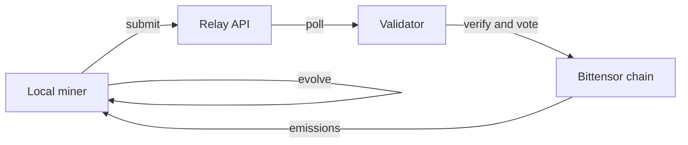

# Direct Mining Guide (Task-Agnostic)

Direct mining in BitSota means you evolve candidate learning systems locally and submit promising results to validators via the relay. We’re challenge-driven and **the very first challenge on this subnet is an AutoML-Zero replication** (baseline reproduction + incremental improvements).

## What is Direct Mining?

Direct miners run an evolutionary/GP engine that searches over algorithm space. When a candidate surpasses the current acceptance bar on the active benchmark, it’s submitted to the relay. Validators independently audit and vote on rewards through the smart contract.

## How It Works



1. Your miner proposes an algorithm/program (e.g., via a DSL or op-graph).
2. The engine mutates/recombines candidates across generations.
3. Candidates are evaluated against the **current challenge’s** benchmark (inputs, metrics, and acceptance bar are provided per challenge).
4. When a candidate exceeds the bar, it’s auto-submitted to the relay.
5. Validators fetch and re-run your candidate in a standardized sandbox.
6. If independent scores confirm your claim within tolerance, validators vote on-chain.
7. On threshold reach (e.g., M-of-N trustees), rewards flow to your coldkey.

> **First Challenge:** AutoML-Zero replication (faithful reproduction first; then measured improvements under the same protocol).

## Requirements

**Hardware (minimum reasonable):**

* 4+ CPU cores, 8 GB RAM, a few GB free disk, stable internet.

**Compute Expectations:**
A single mining run can span tens to hundreds of generations; each generation evaluates multiple candidates. Wall-time varies by hardware and the active challenge’s evaluation cost.

## Setup

**Desktop GUI:**

* Install the app
* Load a hotkey from your machine or import one
* Pick **current challenge** (default = latest active)
* Start mining

## Output (What You’ll See)

```
Gen 12/150: best=accepted_metric 0.73, mean 0.58
Gen 27/150: best 0.79, mean 0.65
...
Threshold surpassed! score=0.81 ≥ current_bar=0.80
Submitting to relay...
Submitted. result_id: abc123
```

Interpretation:

* Your best candidate exceeded the acceptance bar for the **current challenge**.
* The relay will coordinate validator reproduction; if confirmed, a vote is triggered.

## Evolution Engines

* **Archive Engine (recommended):**

  * Keeps a diverse archive of elites
  * Diversity pressure to avoid collapse
  * Fitness-weighted sampling
* **Baseline GA:**

  * Simpler population GA
  * Faster iteration, more prone to local traps

Configure via `engine_type: "archive"` or `"ga"`.

## Challenges & Tasks

We’re **task-agnostic**: challenges rotate and can include classification, regression, RL, program synthesis, etc. Each challenge specifies its:

* **Evaluation interface** (I/O schema or runner),
* **Metric(s)** and **acceptance bar**,
* **Reproduction rules** (determinism, seeds, tolerances).

> **Active kickoff:** **AutoML-Zero replication**. Start by reproducing the reference result; then submit incremental improvements under the same rules.

## Rewards (High-Level)

You earn ALPHA when:

1. Your submission exceeds the published bar for the challenge,
2. Validators independently reproduce within tolerance,
3. The on-chain vote (e.g., 2-of-3 trustees or configured quorum) passes.

Payouts are automatic to a coldkey that you provide once the vote finalizes.

## Tips

* **Repro discipline:** Pin seeds, envs, and versions; match the challenge’s sandbox spec.
* **Throughput matters:** More candidate evals per minute → more hits. Optimize evaluation bottlenecks.
* **Stay current:** Bars can move as stronger submissions land. Pull challenge metadata before long runs.

## Troubleshooting

* **“No breakthrough after N generations”**
  Normal. Stochastic search. Try more generations, different seeds, or the archive engine.
* **“Submission rejected”**
  Ensure you targeted the **current** bar and matched the exact evaluation protocol.
## Next Steps

* Join Discord for support and challenge updates.
* Scale out (multiple miners, varied seeds/engines).
* If direct mining isn’t ideal for your hardware, see the Pool Mining guide.
