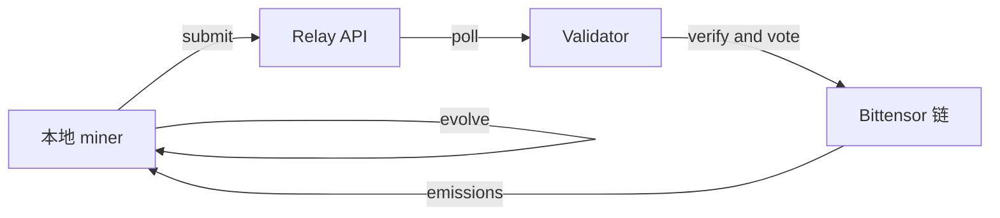

# 直接挖矿指南 任务无关

在 BitSota 中，直接挖矿意味着你在本地演化候选学习系统，并通过 relay 将更有希望的结果提交给验证者。我们以挑战驱动，**该子网的首个挑战是 AutoML Zero 复现** 先做基线复现，再做可度量的增量改进。

## 什么是直接挖矿

直接矿工会运行一个演化或遗传编程引擎，在算法空间中搜索。当某个候选在当前基准上超过接受阈值时，会被提交到 relay。验证者会在独立环境中复现并投票，随后通过链上机制分配奖励。

## 工作原理



1. 你的 miner 提出一个算法或程序，例如通过 DSL 或 op graph。
2. 引擎跨代对候选进行变异与重组。
3. 候选会在**当前挑战**的基准上评估，输入、指标与阈值由每个挑战定义。
4. 当候选超过阈值时，会自动提交到 relay。
5. 验证者拉取候选并在标准化沙盒中重跑。
6. 若独立评估分数在容差内确认你的结果，验证者会发起链上投票。
7. 当投票达到门限，例如 M of N 的门限，奖励会发放到你的 coldkey。

> **首个挑战：** AutoML Zero 复现，先忠实复现参考结果，再在同一协议下提交可量化的改进。

## 需求

**硬件 参考下限：**

* 4 核以上 CPU、8 GB 内存、若干 GB 可用磁盘空间、稳定网络。

**计算预期：**
一次挖矿运行可能持续数十到数百代，每代会评估多个候选。总耗时取决于硬件与当前挑战的评估成本。

## 运行准备

**桌面 GUI：**

* 安装应用
* 从本机加载 hotkey 或导入一个
* 选择**当前挑战** 默认最新激活
* 开始挖矿

## 输出 你会看到什么

```
Gen 12/150: best=accepted_metric 0.73, mean 0.58
Gen 27/150: best 0.79, mean 0.65
...
Threshold surpassed! score=0.81 ≥ current_bar=0.80
Submitting to relay...
Submitted. result_id: abc123
```

含义：

* 你的最佳候选超过了**当前挑战**的接受阈值。
* relay 会协调验证者复现；若确认，将触发投票。

## 演化引擎

* **Archive 引擎 推荐：**

  * 保持多样化的精英档案
  * 通过多样性压力避免坍缩
  * 基于适应度加权采样
* **Baseline GA：**

  * 更简单的种群 GA
  * 迭代更快，但更容易陷入局部最优

通过 `engine_type: "archive"` 或 `"ga"` 配置。

## 挑战与任务

我们是**任务无关**的：挑战会轮换，可能包含分类、回归、强化学习、程序合成等。每个挑战会定义：

* **评估接口** 输入输出或 runner
* **指标与接受阈值**
* **复现规则** 例如确定性、随机种子与容差

> **当前启动挑战：** **AutoML Zero 复现**。建议先复现参考结果，再在同一规则下提交增量改进。

## 奖励 高层概览

你会在以下条件满足时获得 ALPHA：

1. 你的提交超过挑战公布的阈值
2. 验证者在容差内独立复现
3. 链上投票通过，例如 2 of 3 或配置的法定人数

投票最终确定后，奖励会自动发放到你提供的 coldkey。

## 小建议

* **复现纪律：** 固定 seeds、环境与版本，匹配挑战的沙盒规范。
* **吞吐量很关键：** 每分钟评估更多候选，命中概率更高。优先优化评估瓶颈。
* **保持同步：** 阈值会随着更强提交不断提高。长跑前先刷新挑战元数据。

## 故障排查

* **连续 N 代没有突破**
  正常。随机搜索本就如此。尝试更多代数、不同种子或使用 archive 引擎。
* **提交被拒绝**
  确认你使用的是**当前**阈值，并严格匹配评估协议。

## 下一步

* 加入 Discord 获取支持与挑战更新。
* 扩展算力 多个 miner 多种 seeds 与引擎组合。
* 如果硬件不适合直接挖矿，请参考矿池挖矿指南。
