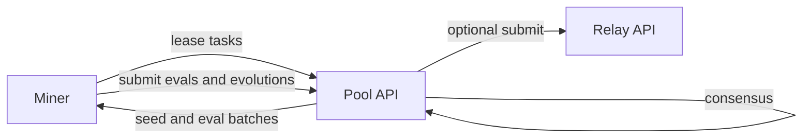

# 矿池挖矿指南

矿池挖矿让多个矿工协作完成演化与评估任务，并基于贡献分享奖励。与单个矿工在本地长时间搜索不同，Pool 会把工作拆成更小的块并聚合结果。

## 什么是矿池挖矿

矿池挖矿是一种协作方式：pool 协调器把任务分发给多个矿工。一部分矿工负责演化算法，另一部分矿工负责评估算法。pool 聚合结果、达成共识，并代表所有参与者把最佳算法提交给验证者。

## 工作原理



1. 矿工使用 Bittensor hotkey 签名注册与认证。
2. 矿工以 batch 或 lease 的形式请求工作。
3. Pool 返回：
   - 待评估的 algorithms
   - 待演化的 seed algorithms
   - 演化预算与超时
4. 矿工把评估结果与演化提案提交回 Pool。
5. 当样本足够时，Pool 计算共识。
6. Pool 记录贡献，并运行 epoch 逻辑计算支付。
7. Pool 可选择把最佳结果转发到 relay，便于验证者协调。

## 矿池挖矿 vs 直接挖矿

**矿池挖矿：**
- 计算门槛更低  演化运行更短
- 评估工作可获得更稳定的小额收益
- 不必亲自打破 SOTA
- Pool 负责与验证者通信
- 与其他矿池参与者分享奖励

**直接挖矿：**
- 计算门槛更高  完整演化循环
- 奖励更大但更不频繁
- 必须超过 SOTA 阈值
- 直接与验证者通信
- 保留 100% 奖励

如果你具备以下特点，建议选择矿池挖矿：
- 硬件有限  笔记本或单 CPU
- 在线不稳定  无法 24 小时运行
- 更偏好稳定收益而非抽奖式收益

## 需求

**硬件：**
- CPU：2 核以上
- 内存：至少 4GB
- 存储：至少 1GB 可用空间
- 网络：稳定互联网连接

**软件：**
- Python 3.10 或更高
- Bittensor 钱包

## 运行方式

矿池模式通常由 GUI 驱动，但也可以在本地通过脚本跑同样的工作流。

### GUI 模式

配置 `gui_config.json` 并设置：

```json
{
  "pool_endpoint": "http://127.0.0.1:8434"
}
```

然后运行 `python3 -m gui`，在任务下拉框选择 Pool 并开始挖矿。

### 使用 sidecar 的无界面模式

这与 GUI 架构一致：

- 一个 sidecar 进程
- 一个计算 worker 从 sidecar 拉取作业
- 一个 driver 与 Pool API 通信并提交结果

```bash
docker compose -f Pool/docker-compose.sim.yaml up -d db api
python3 -m sidecar --host 127.0.0.1 --port 8123
python3 -m scripts.pool_miner_sidecar --sidecar-url http://127.0.0.1:8123 --run-id pool_smoke --workers 1
python3 -m scripts.pool_sidecar_driver --pool-url http://127.0.0.1:8434 --sidecar-url http://127.0.0.1:8123 --run-id pool_smoke --duration-s 30
```

## 理解 Pool 任务

**演化任务：**
你会拿到 2 个 seed 算法，对它们演化 50 代，并把最佳演化结果提交回 pool。

奖励：
- 基础奖励：2.0 声誉点
- 若你的算法共识分数大于等于 0.7，则按共识分数倍增
- 示例：若共识评估你的算法得分为 0.85，则你获得 2.0 × 0.85 = 1.7 声誉点

**评估任务：**
你会拿到一批由其他矿工演化的算法，你需要在测试数据集上跑评估并上报分数。

奖励：
- 每个准确评估的基础奖励：1.0 声誉点
- 准确指你的分数在中位数共识的 10% 容差内
- 示例：你准确评估了 5 个算法，则获得 5.0 声誉点

## 共识机制

pool 使用中位数共识来防止作弊：

1. 算法 A 需要评估
2. Pool 分配给矿工 X、Y、Z
3. 矿工 X 上报：0.92
4. 矿工 Y 上报：0.90
5. 矿工 Z 上报：0.91
6. 中位数 = 0.91
7. 在 10% 容差内的矿工获得奖励 例如 X 与 Z
8. 如果 Y 上报 0.50 这样的离群值，Y 将不被奖励

这同时防止：
- 虚报高分 例如声称 0.99 但实际 0.80
- 恶意压低分数 例如声称 0.60 以干扰他人

## 声誉与奖励

pool 在每个 epoch 内累计声誉点 通常 1 小时：

**声誉累计示例：**
```
Epoch 1:
- 10 个准确评估 = 10.0 声誉
- 2 个成功演化 = 2.0 × 0.8 + 2.0 × 0.75 = 3.1 声誉
- 合计：13.1 声誉点
```

**换算为 RAO：**
epoch 结束时，总预算 例如 1,000,000,000 RAO 会按比例分配：

```
Your RAO = (Your Reputation / Total Pool Reputation) × Epoch Budget
```

如果 pool 总声誉为 1000，而你获得 13.1：
```
Your RAO = (13.1 / 1000) × 1,000,000,000 = 13,100,000 RAO
```

**提现：**
当你累计至少 5,000,000 RAO 后即可提现到 coldkey。提现通常由矿池运营者手动处理。

## 矿池经济学

**矿池费用：**
具体以矿池运营者为准。常见结构是 5% 到 10% 的奖励用于矿池基础设施与验证者成本。

**最低支付：**
最低 5,000,000 RAO，用于减少链上交易开销。

**epoch 时长：**
很多矿池使用 1 小时 epoch。更短的 epoch 代表更频繁的小额支付，更长的 epoch 代表更少但更大金额的支付。

**单矿工上限：**
矿池可能将个人奖励限制为 epoch 预算的 5%，以确保分配公平。

## 监控你的表现

**余额检查：**
Pool GUI 显示当前余额与待发放奖励。

**评估准确率：**
观察你的评估有多少比例落在共识容差内，目标 95% 以上。

**演化成功率：**
观察你有多少演化结果达到 0.7 的奖励阈值。

**每小时声誉：**
监控你的收益速度，可通过以下方式优化：
- 有评估任务时优先评估  更快获取声誉
- 调优演化参数以提高共识分数
- 保持较高评估准确率

## 故障排查

**没有任务可用：**
pool 可能暂时没有任务。等待 30 到 60 秒重试。若持续出现，请在 Discord 查看矿池状态。

**任务超时：**
你完成任务超过 3 小时，任务会被重新分配。确认硬件能更快完成，或降低 `max_generations`。

**评估被拒绝  未进入共识：**
你的分数与其他评估者差异很大。可能原因：
- 评估代码存在 bug
- 数据集版本不一致  确保已更新
- 硬件导致计算错误

请更新软件并重新验证安装。

**无法提现  低于最低值：**
先累计到至少 5,000,000 RAO 再提现。

## Pool API 与认证

Pool 端点使用以下认证头：

- `X-Key`  hotkey
- `X-Timestamp`  unix 秒
- `X-Signature`  对消息 `auth:{X-Timestamp}` 的签名

端点列表见 [Pool API](reference/pool-api.md)。

## 给矿池矿工的建议

**优化任务选择：**
如果可选，评估任务获得声誉更快，而演化任务若分数高通常每任务收益更高。

**持续运行：**
矿池挖矿依赖稳定性。24 小时运行会稳定累计声誉。

**关注矿池健康：**
查看参与人数。过度拥挤会降低个人份额。可考虑切换矿池，或升级硬件转向直接挖矿。

**保持准确：**
一次评估偏离共识影响不大，但持续不准确会显著降低收益。

**定期更新：**
矿池运营者会更新任务类型与参数。请及时更新 miner 以保持兼容。

## 下一步

- 如果你在本地运行，请从 [矿池功能测试](guides/pool-functional-testing.md) 开始。
- 如果你要跑包含 relay 与 validator 的端到端闭环，请从 [本地测试](local-testing.md) 开始。

## 下一步

- 加入 [Bitsota Discord](https://discord.gg/jkJWJtPuw7) 获取矿池挖矿支持
- 监控声誉并优化挖矿策略
- 如果硬件升级，考虑切换到直接挖矿

如果你想理解整个系统的奖励机制，请看 [奖励指南](rewards.md)。
