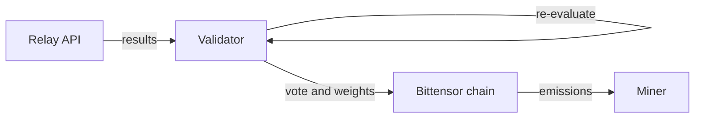

# Validator Guide

Validators in BitSota evaluate miner submissions, verify algorithm quality, and distribute rewards through on-chain weight setting using Yuma consensus.

## What is a Validator?

Validators receive algorithm submissions from miners through the relay server, independently re-evaluate each submission on standardized datasets, and set on-chain weights to direct network emissions to miners who discover algorithms that beat the current performance threshold.

## How It Works



Validators fix all evaluations to the CIFAR-10 binary (airplane vs automobile) dataset. Every relay submission is re-run on that benchmark regardless of the task type claimed by a miner.

1. RelayPoller background thread fetches new submissions every 60 seconds
2. Validator verifies miner's cryptographic signature to prevent forgery
3. Validator runs the algorithm independently using the same test datasets
4. Validator compares their score against the miner's claimed score
5. If score delta exceeds 10%, validator votes to blacklist the miner
6. If validation passes, validator selects the best submission from the batch
7. Validator votes on relay server to accept new SOTA candidate
8. When enough validators vote for same candidate, relay finalizes SOTA event
9. Weight manager sets on-chain weights directing emissions to winning miner and burn address

## Requirements

**Hardware:**
- CPU: 8+ cores recommended
- RAM: 16GB minimum
- Storage: 10GB free space
- Network: Stable, low-latency connection

**Software:**
- Python 3.10 or higher
- Bittensor wallet registered as validator on subnet

**Stake Requirements:**
Validators must have sufficient ALPHA stake to be recognized by the metagraph and set weights. Check current requirements with the subnet owner.

## Setup

**1. Install Dependencies**
```bash
git clone https://github.com/AlveusLabs/BitSota.git
cd BitSota
pip install -r requirements.txt
pip install -e .
```

**2. Create Bittensor Wallet**
```bash
btcli wallet new_coldkey --wallet.name validator_wallet
btcli wallet new_hotkey --wallet.name validator_wallet --wallet.hotkey validator_hotkey
```

**3. Register as Validator**
```bash
btcli subnet register --netuid 94 --wallet.name validator_wallet --wallet.hotkey validator_hotkey
```

## Running the Validator

```bash
python neurons/validator_node.py --config validator_config.local.yaml
```

Optional logging-only test queue (UID0-only):

```bash
python neurons/validator_node.py --config validator_config.local.yaml --accept-test
```

The validator starts two background services:
1. RelayPoller: Fetches miner submissions every 60 seconds
2. WeightManager: Updates on-chain weights when SOTA events are finalized

## Understanding Validator Output

**Relay Consensus Mode:**
```
Received 5 results from relay
Miner abc12345: Miner Score = 0.9300, Validator Score = 0.9250, SOTA = 0.9200
Miner def67890: Miner Score = 0.9400, Validator Score = 0.8100, SOTA = 0.9200
Blacklisting miner def67890 - score delta too large
Best submission: Miner abc12345 with score 0.9250
Submitting SOTA vote to relay for miner abc12345 with score 0.9250 at block 12345
Relay vote status: accepted (2/3) in 0.45s
Finalized event: start=12340 end=12700
Set weights → burn 0.900 / winner 0.100 (abc12345)
```

**What this means:**
- First miner's submission is legitimate (0.93 claimed, 0.925 validated, within 10% tolerance)
- Second miner attempted to cheat (0.94 claimed, 0.81 actual, exceeds 10% cutoff)
- Validator votes to blacklist the cheater on relay
- Validator votes on relay to accept abc12345 as new SOTA
- Relay reaches consensus (2/3 votes) and finalizes SOTA event
- Validator sets weights: 90% to burn, 10% to winner

**Local Mode:**
```
Received 5 results from relay
Miner abc12345: Miner Score = 0.9300, Validator Score = 0.9250, SOTA = 0.9200
Best submission: Miner abc12345 with score 0.9250
Updated local winner candidate → abc12345 (score=0.9250)
Set weights → burn 0.900 / winner 0.100 (abc12345)
Submitting SOTA vote to relay for miner abc12345 with score 0.9250 at block 12345
```

**What this means:**
- Validator evaluates submission and finds it beats current SOTA
- Validator immediately updates local winner to abc12345
- Validator sets weights right away without waiting for relay consensus
- Validator still submits vote to relay for coordination with other validators

## Validation Process

**Step 1: Signature Verification**
```python
ValidatorAuth.verify_miner_signature(miner_hotkey, timestamp_message, signature)
```
Ensures the submission actually came from the claimed miner's wallet.

**Step 2: Algorithm Re-evaluation**
```python
is_valid, validator_score = verify_solution_quality(algorithm_result, sota_score)
```
Validators now run every candidate on a deterministic slice of the CIFAR-10 task space.
Each "task" corresponds to a class pair, projection matrix, and dataset split. The
validator samples `task_count` tasks once using `task_seed` and reuses that set for every
submission, providing a repeatable score while still covering multiple projections.

Defaults live in `validator_hyperparams.json` (env overrides still work via
`VALIDATOR_TASK_COUNT` / `VALIDATOR_TASK_SEED`). The current code defaults are
`task_count=128`, `task_seed=1337`.

**Step 3: SOTA Check**
If validator's score is below the current State-of-the-Art threshold, submission is dropped regardless of miner's claimed score.

**Step 4: Score Delta Check**
```python
if abs(validator_score - miner_score) > 0.1:  # 10% tolerance
    blacklist_miner(miner_hotkey)
```
Large discrepancies indicate dishonesty or bugs.

**Step 5: Relay SOTA Voting**
```python
relay_client.submit_sota_vote(miner_hotkey, validator_score, seen_block=current_block)
```
Validator submits vote to relay server using the validator's own evaluated score, not the miner's claim.

## SOTA Consensus and Weight Setting

Validators can use two approaches for weight setting:

### Relay Consensus Mode (winner_source: "relay")

The relay server aggregates validator votes to finalize SOTA events:

- Multiple validators independently evaluate submissions
- Each validator votes on relay for candidates that beat current SOTA
- When enough validators agree, relay finalizes SOTA event
- Finalized event includes: miner_hotkey, score, start_block, end_block
- Validators fetch finalized events and update on-chain weights

This mode ensures all validators converge on the same winner through relay consensus before setting weights.

### Local Mode (winner_source: "local")

Validators set weights based on their own evaluation without waiting for relay consensus:

- Validator evaluates submissions independently
- When finding candidate above SOTA, validator sets weights immediately
- No waiting for relay finalization
- Faster weight updates but validators may diverge on winner choice
- Still submits votes to relay (unless `submit_sota_votes: false`)

Local mode is faster but less coordinated. Relay mode is slower but ensures validator alignment.

**Weight Distribution (Both Modes):**
- 90% weight to burn address (removes tokens from circulation)
- 10% weight to current winner (relay-finalized or local best)
- Weights change when new winner is identified (relay event or local evaluation)
- Network emissions follow these weights via Yuma consensus

**Checking SOTA Status:**
```bash
curl https://relay.bitsota.com/sota/events?limit=10
```

Shows recent finalized SOTA events and current threshold.

## Weight Management

Validators set on-chain weights to direct network emissions to SOTA winners and burn address.

The CapacitorlessStickyBurnSplitWeightManager runs automatically in the background:

**Relay Consensus Mode (winner_source: "relay"):**
- Polls relay for finalized SOTA events every 60 seconds
- Tracks the most recent SOTA winner from relay events
- Sets weights when new SOTA event is finalized
- All validators converge on same winner
- Distributes weight: 90% burn, 10% relay winner

**Local Mode (winner_source: "local"):**
- Tracks best score validated by this validator
- Updates local winner when better candidate found
- Sets weights immediately after evaluation (if `apply_weights_inline: true`)
- Each validator may choose different winner temporarily
- Distributes weight: 90% burn, 10% local winner
- Optionally requires minimum improvement (`min_winner_improvement`)

**Both Modes:**
- Use Bittensor weight rate limits to avoid spam
- Respect chain epoch boundaries for weight updates
- Fall back to burn-only if winner not registered in metagraph

Weights determine how network emissions are distributed via Yuma consensus. The burn address receives 90% to reduce circulating supply, while the current SOTA winner receives 10% as reward.

## Blacklisting

When validators detect cheating (score delta > 10%), they vote to blacklist miners through the relay server:

```python
relay_client.blacklist_miner(miner_hotkey)
```

After enough validators vote (consensus-based), the relay server rejects all future submissions from that miner. This is a protection mechanism against:
- Miners falsifying evaluation scores
- Buggy miner implementations
- Deliberate gaming attempts

## Monitoring

**Metrics Logging:**
All validators log detailed metrics to `validator_metrics.log`:
- Evaluation batch timings
- Individual miner results (passed/failed/blacklisted)
- Contract submission successes
- Periodic summaries every 10 minutes

**Health Checks:**
The validator automatically restarts background threads if they crash:
```
Weight manager thread died. Restarting...
Relay poller thread died. Restarting...
```

**Manual Checks:**
```bash
# View recent logs
tail -f validator_metrics.log

# Check if validator is running
ps aux | grep validator_node

# Check SOTA events
curl https://relay.bitsota.com/sota/events?limit=10

# Check current SOTA threshold
curl https://relay.bitsota.com/sota_threshold
```

## Troubleshooting

**"Failed to get results from relay":**
- Check relay URL in config is correct
- Verify internet connection
- Relay server might be down (check Discord)

**"Could not get SOTA score, cannot process results":**
- Relay server is unreachable
- Check `relay.url` in config
- Verify relay is responding: `curl https://relay.bitsota.com/sota_threshold`

**"Burn hotkey not found in metagraph":**
- Burn hotkey address in config is incorrect
- Metagraph sync failed
- Check `capacitorless.burn_hotkey` matches official burn address

**"Set weights failed":**
- Bittensor weight rate limit not satisfied (must wait between weight updates)
- Insufficient validator stake
- Metagraph out of sync

**"No results passed validation and SOTA checks":**
All submissions in this batch either:
- Had invalid signatures
- Scored below SOTA
- Had score deltas indicating cheating
This is normal if miner quality is low.

**"Winner hotkey not in metagraph yet":**
Validator falls back to burn-only weights when winner hasn't registered. Weights will update once winner registers on subnet.

## Advanced Configuration

**Adjust polling interval:**
```yaml
relay:
  poll_interval_seconds: 30  # Poll more frequently
```
Lower values = more responsive but higher bandwidth usage.

**Adjust blacklist threshold:**
```yaml
blacklist:
  cutoff_percentage: 0.05  # Stricter (5% tolerance)
```
Lower values = stricter validation but might blacklist honest miners with slight evaluation differences.

**Change weight update frequency:**
```yaml
capacitorless:
  event_refresh_interval_s: 120  # Check for new SOTA events every 2 minutes
  poll_interval_s: 10.0  # Weight manager tick interval
```

**Use local winner source:**
```yaml
capacitorless:
  winner_source: "local"  # Set weights immediately after validation
  min_winner_improvement: 0.01  # Require 1% improvement to update local winner
  apply_weights_inline: true  # Apply weights right after evaluation
  submit_sota_votes: true  # Still vote on relay for coordination (set false for pure local mode)
```

**Choosing Between Modes:**

Relay mode:
- All validators agree on same winner
- Slower weight updates (wait for consensus)
- More coordinated subnet behavior
- Recommended for production

Local mode:
- Faster weight updates
- Validators may choose different winners temporarily
- Lower latency response to SOTA breakthroughs
- Useful for testing or independent operation

## Economics

Validators earn ALPHA emissions through the standard Bittensor mechanism based on:
- Validator stake amount
- Subnet performance
- Network-wide emission schedule

Validators distribute emissions to miners by setting on-chain weights. In capacitorless_sticky mode, 90% of emissions go to burn (reducing supply) and 10% to the current SOTA winner. This creates a deflationary mechanism while rewarding innovation.

## Security Best Practices

**Protect your keys:**
- Never share wallet seeds or private keys
- Use separate wallets for different functions (cold storage for main funds)
- Keep hotkey secured on validator server

**Monitor for attacks:**
- Watch for unusual submission patterns
- Check for coordinated score manipulation
- Report suspicious activity to subnet operators

**Keep software updated:**
```bash
git pull origin main
pip install -r requirements.txt --upgrade
```

## Next Steps

- Join [BitSota Discord](https://discord.gg/6vCYV2WC) for validator coordination
- Monitor your validator's performance and weight setting success
- Review the [Rewards Guide](rewards.md) to understand the full incentive mechanism
- Check [Reward Modes Guide](reward-modes.md) for alternative weight distribution strategies

For understanding the reward distribution system, see [Rewards Guide](rewards.md).
