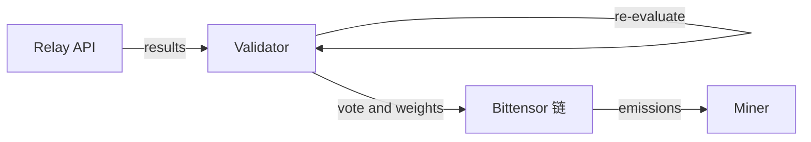

# 验证者指南

BitSota 的验证者会评估矿工提交、验证算法质量，并通过基于 Yuma 共识的链上权重设置分配奖励。

## 什么是验证者

验证者通过 relay 服务器接收矿工提交的算法，独立地在标准数据集上重新评估每个提交，并设置链上权重，把网络 emissions 导向那些发现了超过当前性能阈值算法的矿工。

## 工作原理



验证者会把所有评估固定在 CIFAR-10 二分类任务上，airplane vs automobile。无论矿工声称的任务类型是什么，所有 relay 提交都会在该基准上重跑。

1. RelayPoller 后台线程每 60 秒拉取一次新提交
2. 验证者验证矿工的加密签名以防伪造
3. 验证者在相同测试数据集上独立运行算法
4. 验证者把自己的分数与矿工声称分数进行对比
5. 若分数差异超过 10%，验证者会投票把该矿工加入黑名单
6. 若验证通过，验证者从该批次中选择最佳提交
7. 验证者在 relay 上投票接受新的 SOTA 候选
8. 当足够多验证者对同一候选投票时，relay 最终确定 SOTA 事件
9. 权重管理器设置链上权重，把 emissions 导向胜者与 burn 地址

## 需求

**硬件：**
- CPU：推荐 8 核以上
- 内存：至少 16GB
- 存储：至少 10GB 可用空间
- 网络：稳定且低延迟

**软件：**
- Python 3.10 或更高
- 已在子网上注册为验证者的 Bittensor 钱包

**质押要求：**
验证者必须拥有足够的 ALPHA 质押，才能在 metagraph 上被识别并设置权重。具体要求请向子网维护方确认。

## 安装与注册

**1  安装依赖**
```bash
git clone https://github.com/AlveusLabs/BitSota.git
cd BitSota
pip install -r requirements.txt
pip install -e .
```

**2  创建 Bittensor 钱包**
```bash
btcli wallet new_coldkey --wallet.name validator_wallet
btcli wallet new_hotkey --wallet.name validator_wallet --wallet.hotkey validator_hotkey
```

**3  注册为验证者**
```bash
btcli subnet register --netuid 94 --wallet.name validator_wallet --wallet.hotkey validator_hotkey
```

## 运行验证者

```bash
python neurons/validator_node.py --config validator_config.local.yaml
```

可选：仅用于日志的测试队列，仅 UID0：

```bash
python neurons/validator_node.py --config validator_config.local.yaml --accept-test
```

验证者会启动两个后台服务：
1. RelayPoller：每 60 秒拉取矿工提交
2. WeightManager：当 SOTA 事件最终确定后更新链上权重

## 理解验证者输出

**Relay 共识模式：**
```
Received 5 results from relay
Miner abc12345: Miner Score = 0.9300, Validator Score = 0.9250, SOTA = 0.9200
Miner def67890: Miner Score = 0.9400, Validator Score = 0.8100, SOTA = 0.9200
Blacklisting miner def67890 - score delta too large
Best submission: Miner abc12345 with score 0.9250
Submitting SOTA vote to relay for miner abc12345 with score 0.9250 at block 12345
Relay vote status: accepted (2/3) in 0.45s
Finalized event: start=12340 end=12700
Set weights → burn 0.900 / winner 0.100 (abc12345)
```

**含义：**
- 第一个矿工的提交是可信的，声称 0.93，验证 0.925，处于 10% 容差内
- 第二个矿工试图作弊，声称 0.94，实际 0.81，超过 10% 门限
- 验证者在 relay 上投票拉黑作弊矿工
- 验证者在 relay 上投票接受 abc12345 为新 SOTA
- relay 达成共识 2/3 并最终确定 SOTA 事件
- 验证者设置权重：90% 给 burn，10% 给 winner

**本地模式：**
```
Received 5 results from relay
Miner abc12345: Miner Score = 0.9300, Validator Score = 0.9250, SOTA = 0.9200
Best submission: Miner abc12345 with score 0.9250
Updated local winner candidate → abc12345 (score=0.9250)
Set weights → burn 0.900 / winner 0.100 (abc12345)
Submitting SOTA vote to relay for miner abc12345 with score 0.9250 at block 12345
```

**含义：**
- 验证者评估提交并确认它超过当前 SOTA
- 验证者立即把本地 winner 更新为 abc12345
- 验证者不等待 relay 共识，直接设置权重
- 验证者仍会向 relay 提交投票，以便与其他验证者协调

## 验证流程

**步骤 1：签名验证**
```python
ValidatorAuth.verify_miner_signature(miner_hotkey, timestamp_message, signature)
```
确保提交确实来自声明的矿工钱包。

**步骤 2：算法重新评估**
```python
is_valid, validator_score = verify_solution_quality(algorithm_result, sota_score)
```
验证者会在 CIFAR-10 任务空间的一个确定性切片上运行每个候选。
每个 task 对应一个类别对、投影矩阵与数据集切分。验证者使用 `task_seed` 生成一次 `task_count` 个 task，并在每个提交上复用这组 task，从而获得可重复的分数，同时覆盖多个投影。

默认值在 `validator_hyperparams.json` 中，仍可通过 `VALIDATOR_TASK_COUNT` 与 `VALIDATOR_TASK_SEED` 环境变量覆盖。当前代码默认 `task_count=128`、`task_seed=1337`。

**步骤 3：SOTA 检查**
如果验证者分数低于当前 SOTA 阈值，该提交会被丢弃，即使矿工声称的分数更高。

**步骤 4：分数差异检查**
```python
if abs(validator_score - miner_score) > 0.1:  # 10% tolerance
    blacklist_miner(miner_hotkey)
```
差异过大通常意味着不诚实或实现存在 bug。

**步骤 5：Relay SOTA 投票**
```python
relay_client.submit_sota_vote(miner_hotkey, validator_score, seen_block=current_block)
```
验证者用自己评估得到的分数向 relay 提交投票，而不是使用矿工声称的分数。

## SOTA 共识与权重设置

验证者在设置权重时可以采用两种方式：

### Relay 共识模式  `winner_source: "relay"`

relay 服务器会聚合验证者投票以最终确定 SOTA 事件：

- 多个验证者独立评估提交
- 每个验证者对超过当前 SOTA 的候选在 relay 上投票
- 当足够多验证者达成一致时，relay 最终确定 SOTA 事件
- 最终事件包含：miner_hotkey、score、start_block、end_block
- 验证者拉取最终事件并更新链上权重

该模式确保所有验证者在设置权重前通过 relay 共识收敛到同一 winner。

### 本地模式  `winner_source: "local"`

验证者基于自己的评估直接设置权重，不等待 relay 共识：

- 验证者独立评估提交
- 发现超过 SOTA 的候选后立即设置权重
- 不等待 relay 最终确定
- 权重更新更快，但验证者可能暂时选择不同 winner
- 仍会向 relay 提交投票，除非设置 `submit_sota_votes: false`

本地模式更快但协同程度较低。relay 模式更慢，但能保证验证者一致。

**权重分配  两种模式通用：**
- 90% 权重给 burn 地址，用于减少流通供给
- 10% 权重给当前 winner，来自 relay 最终事件或本地最优
- 当识别出新 winner 时权重会变化
- 网络 emissions 通过 Yuma 共识遵循这些权重

**查看 SOTA 状态：**
```bash
curl https://relay.bitsota.com/sota/events?limit=10
```

该接口返回最近最终确定的 SOTA 事件与当前阈值。

## 权重管理

验证者通过链上权重设置把 emissions 导向 SOTA winner 与 burn 地址。

CapacitorlessStickyBurnSplitWeightManager 会在后台自动运行：

**Relay 共识模式  `winner_source: "relay"`：**
- 每 60 秒轮询 relay 获取最终确定的 SOTA 事件
- 跟踪最新的 SOTA winner
- 当新的 SOTA 事件最终确定时设置权重
- 所有验证者会收敛到同一 winner
- 权重分配：90% burn、10% relay winner

**本地模式  `winner_source: "local"`：**
- 跟踪该验证者已验证过的最佳分数
- 当出现更优候选时更新本地 winner
- 在评估后立即设置权重  若 `apply_weights_inline: true`
- 验证者可能暂时选择不同 winner
- 权重分配：90% burn、10% 本地 winner
- 可通过 `min_winner_improvement` 要求最小提升幅度

**两种模式通用：**
- 使用 Bittensor 权重限速避免刷写
- 尊重 epoch 边界的权重更新规则
- 如果 winner 未在 metagraph 注册，则回退为仅 burn

权重决定了网络 emissions 如何通过 Yuma 共识分配。burn 地址获得 90% 以降低流通供给，当前 SOTA winner 获得 10% 作为奖励。

## 黑名单

当验证者检测到作弊，分数差异超过 10%，会通过 relay 投票把矿工加入黑名单：

```python
relay_client.blacklist_miner(miner_hotkey)
```

当足够多验证者投票后，relay 会拒绝该矿工之后的所有提交。这是一种防护机制，用于对抗：
- 矿工伪造评估分数
- buggy 的 miner 实现
- 蓄意利用机制的尝试

## 监控

**指标日志：**
所有验证者会把详细指标写到 `validator_metrics.log`：
- 批次评估耗时
- 单矿工结果 通过 失败 黑名单
- 合约提交成功情况
- 每 10 分钟一次的周期性摘要

**健康检查：**
后台线程崩溃时会自动重启：
```
Weight manager thread died. Restarting...
Relay poller thread died. Restarting...
```

**手动检查：**
```bash
# 查看最近日志
tail -f validator_metrics.log

# 检查 validator 是否在运行
ps aux | grep validator_node

# 查看 SOTA 事件
curl https://relay.bitsota.com/sota/events?limit=10

# 查看当前 SOTA 阈值
curl https://relay.bitsota.com/sota_threshold
```

## 故障排查

**无法从 relay 获取 results：**
- 检查配置中的 relay URL 是否正确
- 确认网络连接
- relay 可能宕机  可以在 Discord 确认

**无法获取 SOTA 分数，无法处理 results：**
- relay 不可达
- 检查配置里的 `relay.url`
- 确认 relay 有响应：`curl https://relay.bitsota.com/sota_threshold`

**metagraph 中找不到 burn hotkey：**
- 配置里的 burn hotkey 地址不正确
- metagraph 同步失败
- 确认 `capacitorless.burn_hotkey` 与官方 burn 地址一致

**设置权重失败：**
- 未满足 Bittensor 权重限速  权重更新之间必须等待
- 验证者质押不足
- metagraph 不一致

**本批次没有任何结果通过验证与 SOTA 检查：**
所有提交可能：
- 签名无效
- 分数低于 SOTA
- 分数差异显示可能作弊
如果矿工质量较低，这属于正常现象。

**winner hotkey 尚未进入 metagraph：**
当 winner 未注册时验证者会回退为仅 burn 权重。待 winner 注册后会更新。

## 高级配置

**调整轮询间隔：**
```yaml
relay:
  poll_interval_seconds: 30  # 轮询更频繁
```
值越小响应越快，但带宽占用更高。

**调整黑名单阈值：**
```yaml
blacklist:
  cutoff_percentage: 0.05  # 更严格 5% 容差
```
值越小越严格，但可能把差异略大的诚实矿工误判为作弊。

**调整权重更新频率：**
```yaml
capacitorless:
  event_refresh_interval_s: 120  # 每 2 分钟检查一次新 SOTA 事件
  poll_interval_s: 10.0  # 权重管理 tick 间隔
```

**使用本地 winner 源：**
```yaml
capacitorless:
  winner_source: "local"  # 验证后立即设置权重
  min_winner_improvement: 0.01  # 要求 1% 提升才更新本地 winner
  apply_weights_inline: true  # 评估后立刻应用权重
  submit_sota_votes: true  # 仍向 relay 投票以协调 纯本地模式可设为 false
```

**如何选择模式：**

Relay 模式：
- 所有验证者对 winner 达成一致
- 权重更新更慢  需要等待共识
- 子网行为更协调
- 生产环境推荐

本地模式：
- 权重更新更快
- 验证者可能暂时选择不同 winner
- 对 SOTA 突破的响应更低延迟
- 适用于测试或独立运行

## 经济学

验证者通过标准的 Bittensor 机制赚取 ALPHA emissions，主要取决于：
- 验证者质押规模
- 子网表现
- 全网 emission 计划

验证者通过设置链上权重把 emissions 分配给矿工。在 capacitorless_sticky 模式下，90% emissions 会被分配到 burn 地址以减少供给，10% 分配给当前 SOTA winner，从而在鼓励创新的同时具备一定通缩属性。

## 安全最佳实践

**保护你的密钥：**
- 不要泄露钱包助记词或私钥
- 为不同用途使用不同的钱包  主资金用冷存储
- 在验证者服务器上保护好 hotkey

**监控攻击：**
- 关注异常提交模式
- 检查是否存在协同操纵分数
- 向子网运营方报告可疑活动

**保持软件更新：**
```bash
git pull origin main
pip install -r requirements.txt --upgrade
```

## 下一步

- 加入 [BitSota Discord](https://discord.gg/6vCYV2WC) 协调验证者运维
- 监控验证者表现与权重设置是否成功
- 阅读 [奖励指南](rewards.md) 理解完整激励机制
- 查看 [奖励模式](reward-modes.md) 了解不同的权重分配策略

如需了解奖励分配系统，请参考 [奖励指南](rewards.md)。
